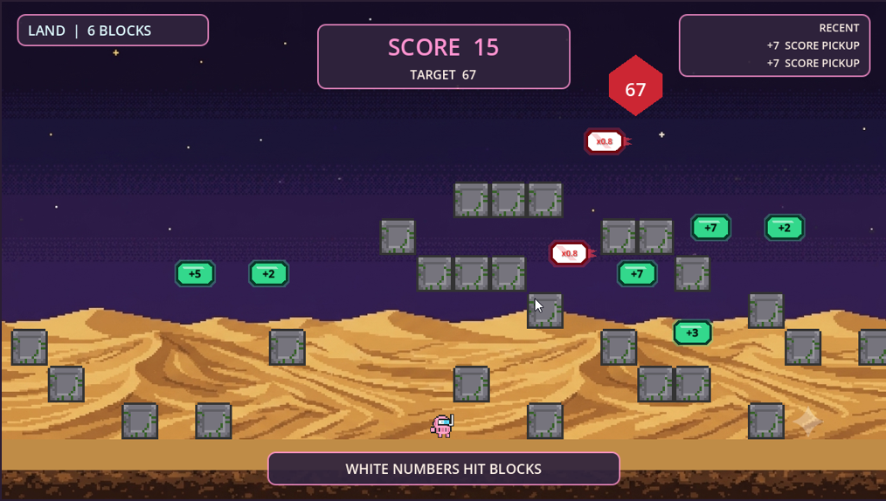
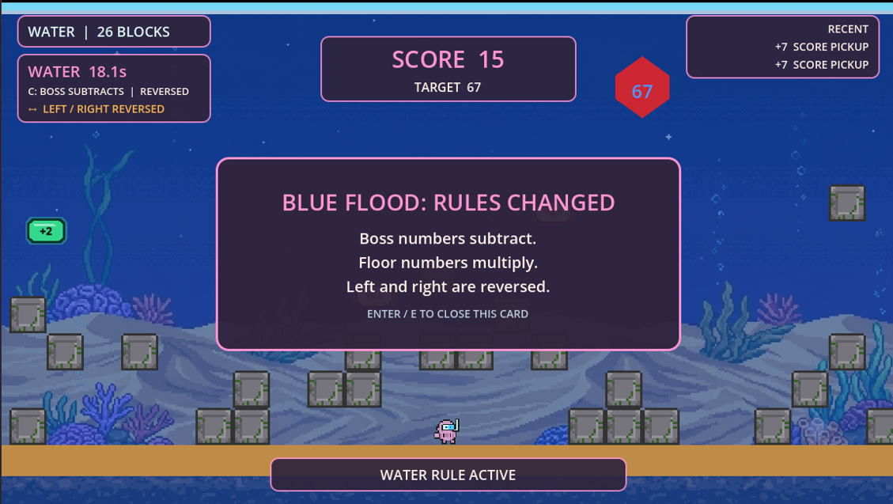
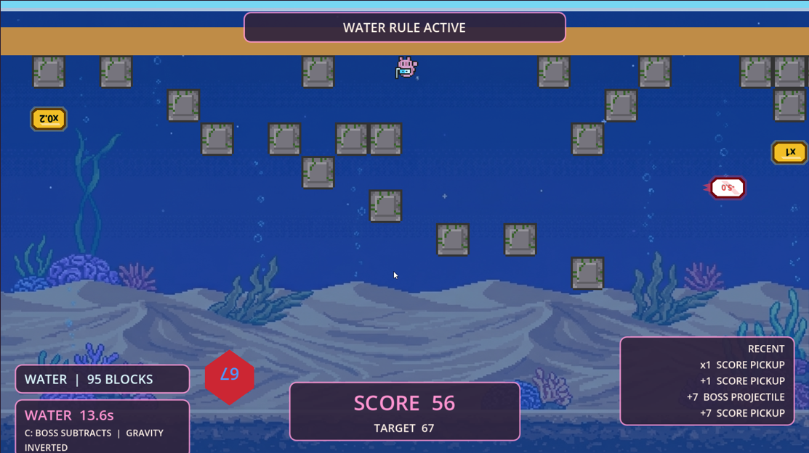
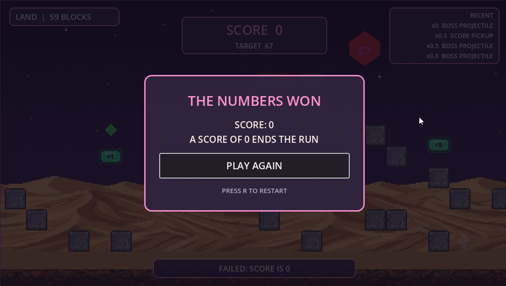
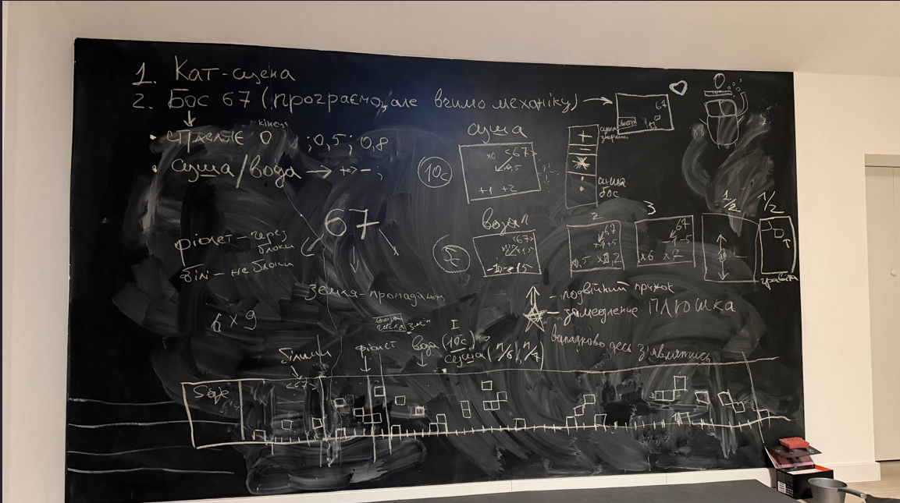

# Slay Diver: Rise of 67

**Play it now on itch.io: https://alina-anila.itch.io/slay-diver-rise-of-67**

Three-person Godot 4.x game-jam project with contract-first integration and shared pitching.

## Story

Deep below the surface, an ancient arithmetic guardian known as **Boss 67** has woken up and is
throwing numbers at anything that moves. You play as the **Slay Diver**, a lone diver who fell into
the boss's domain holding nothing but a running tally that starts at `1`.

There's only one way out: survive the chase across the sand, dodge the boss's projectiles, grab the
floating score pickups, and steer your tally until it lands on **exactly `67`**. Land on `0` along the
way and your dive ends in failure — but overshoot, undershoot, multiply, or subtract your way back,
because the only number that matters at the finish is `67`.

About `28` blocks in, the tide rolls in and the **Blue Flood** hits: the rules change underwater, the
boss's numbers start hitting differently, and a random complication — your controls get reversed, or
the whole world flips `180°` and the sand rises above your head — makes the swim home a lot less
predictable. Grab the rare star and double-jump power-ups when you can; the boss won't slow down for
you otherwise.

Exactly `67` and you've slain the guardian. Anything else, and the deep claims another diver.

## Cutscenes & Lore

The game ships with a full hand-written lore and two cinematic cutscene sequences:

- **Intro cutscene** — three illustrated slides with original Ukrainian voice narration walk the player through the world collapse caused by the arithmetic anomaly, before the dive begins.
- **Fight-start cutscene** — an in-engine action sequence where the Slay Diver and Boss 67 face off before the chase kicks off.
- **Boss-defeat cutscene** — a hit-stop victory sequence when the player reaches exactly 67.
- **Outro cutscene** — three closing illustrated slides with narration, showing the anomaly losing its grip on reality after the exact score is achieved.

The world of *Slay Diver* is built around the concept of a **mathematical anomaly** rewriting the constants of reality — gravity, water physics, and arithmetic itself. Each Blue Flood event is a **SYSTEM OVERRIDE**: the rules change mid-run and the player must adapt on the fly.

## Play

`Slay Diver: Rise of 67` is a desktop platformer boss chase. Change the running score and reach
exactly `67`.

| Action | Controls |
| --- | --- |
| Move | `A` / `D` or Left / Right arrows |
| Jump | `Space`, `W`, or Up arrow |
| Action / skip | `Enter` or `E` |
| Restart | `R` |
| Pause | `Escape` |

### How to win

- Your score starts at `1.00` and the target is exactly `67.00`.
- Walk into floor pickups to add to your score; dodge or use the boss's white and purple projectiles
  (white is blocked by terrain, purple passes through) which apply their own operations to your score.
- Score `67.00` exactly to win. Score `0.00` and the run fails.
- After `18` blocks, purple projectiles unlock. After `28` blocks, the first **Blue Flood** (water
  event) begins and lasts `20` seconds, changing how boss numbers and floor pickups affect your score.
- Later floods can retrigger after a short cooldown if your total score becomes divisible by `6` or
  `7`.
- Each flood also rolls a 50/50 complication: reversed left/right controls, or a full `180°`
  gravity/world flip for its duration.
- Collect the star power-up to slow the boss's numbers, or the green arrow for an extra jump.

Start with:

- `AGENTS.md` for assistant and team working rules
- `ARCHITECTURE.md` for the project shape
- `INTEGRATION_CONTRACT.md` for shared scenes, signals, and dependencies
- `OWNERSHIP.md` for the three coding ownership zones
- `docs/QA_BOT_WORKFLOW.md` for build protection and emergency triage

Run the repository preflight with:

```powershell
tools\qa.cmd
```

On macOS or Linux:

```bash
bash tools/qa.sh
```

## Screenshots

### Land Phase — collecting score toward 67


### BLUE FLOOD: Rules Changed — underwater anomaly card


### Water Phase — gravity inverted, controls reversed


### Game Over — The Numbers Won


### From whiteboard to game — the original design session


## Web Export

The release target is a desktop-browser Godot Web build using the Compatibility renderer and the
committed `Web` export preset.

1. Install the Godot `4.6.3.stable` export templates.
2. Run `tools\qa.cmd`.
3. Export:

   ```powershell
   New-Item -ItemType Directory -Path build/web -Force | Out-Null
   Godot_v4.6.3-stable_win64_console.exe --headless --path . --export-release Web build/web/index.html
   ```

4. ZIP the contents of `build/web` so `index.html` is at the root of the archive.
5. Upload it as an itch.io HTML game with click-to-play and click-to-launch fullscreen enabled.

The first release targets desktop browsers. Do not mark it Mobile Friendly until touch controls and
mobile browser testing are complete. See `docs/ITCH_IO_RELEASE.md` for the release checklist and
attribution copy.
