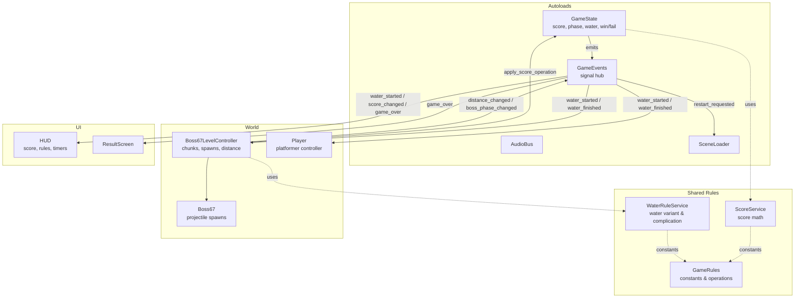

# Slay Diver: Rise of 67

A Boss-chase platformer where the only weapon is arithmetic.

**Play it now:** https://alina-anila.itch.io/slay-diver-rise-of-67

---

## The Hook

> Make the score exactly **67** while Boss 67 tries to mathematically ruin you.

- Score starts at `1.00`
- Land on exactly `67.00` → you win
- Land on `0.00` → the run fails
- Everything on screen is just another `+`, `-`, or `x` on your score

---

## Gameflow: Land Phase

- Walk, jump, and dodge across the authored sand route
- Green pickups **add** to your score (`+1`...`+7`)
- White boss numbers **multiply** your score (`x0`, `x0.5`, `x0.8`) and are blocked by terrain
- HUD tracks score, target `67`, distance in blocks, and recent operations

---

## Gameflow: The Blue Flood (Reversed Controls)

- At `28` blocks (or when score becomes divisible by `6`/`7`), the **Blue Flood** hits
- Water rules swap the operations: boss **subtracts**, floor pickups **multiply**
- 50/50 complication roll: here, **left/right controls are reversed** for `20s`

---

## Gameflow: The Blue Flood (Gravity Inverted)

- The other 50/50 outcome: the whole world **flips 180°**
- Camera + player render upside down, sand rises to the top of the screen
- HUD panels swap top/bottom so the score and rules stay readable
- Physics/operand logic is untouched — purely a disorienting visual twist

---

## Gameflow: Failure State

- Score hits `0` → **"THE NUMBERS WON"**
- Recent-operations panel shows exactly which hits caused the fail
- Instant restart with `R` — no friction between attempts

---

## Architecture Overview

- **Contract-first**: every cross-owner signal lives in `GameEvents` and is documented in
  `INTEGRATION_CONTRACT.md`
- Three ownership zones (Polina / Alina / Rinata) work in parallel without touching each
  other's scenes directly

---

## Our Process

- Started with a chalkboard jam session: cutscene plan, Boss 67 mechanics, water
  variants, operand tables, and the authored level layout
- Locked the numeric rules (`x0`/`x0.5`/`x0.8`, water `A`/`B`/`C` variants,
  `+1..+7` pickups) **before** writing code
- Split into three ownership zones from day one, integrated continuously via a
  shared contract doc

---

## Try It

**https://alina-anila.itch.io/slay-diver-rise-of-67**

Avoid zero. Use your operations. Hit exactly **67**.
